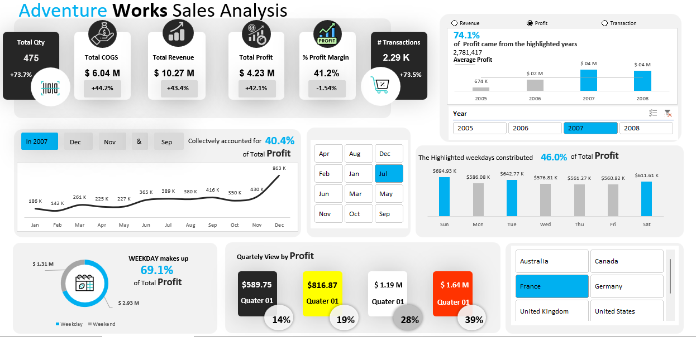

  

# Adventure Works Sales Analysis

> Interactive Excel dashboard visualizing business performance and profit trends over multiple years using dynamic charts, slicers, and KPI cards. Built to demonstrate strong data analytics, visualization, and reporting skills for data-driven insights.

## Overview

This project focuses on creating **visual representations of data** to assess business performance over multiple years and analyze overall profitability.  
The dashboard leverages interactive Excel features such as slicers, PivotTables, and dynamic charts to uncover key trends and insights.

##  Data Model and Tables

The dataset follows a **star schema structure**, consisting of multiple dimension tables connected to a central fact table.  
This structure enables efficient data analysis, filtering, and performance tracking across different dimensions.

###  Tables Used

1. **FactInternetSales**  
   - Central fact table containing detailed sales transactions.  
   - **Key Fields:** SalesAmount, OrderQuantity, TotalProductCost, Profit, OrderDateKey, CustomerKey, ProductKey, SalesTerritoryKey  

2. **DimCustomer**  
   - Contains customer details involved in transactions.  
   - **Key Fields:** CustomerKey, FirstName, LastName, Gender, EmailAddress, GeographyKey  

3. **DimGeography**  
   - Provides location-related details for customers and sales territories.  
   - **Key Fields:** GeographyKey, City, StateProvinceName, CountryRegionCode  

4. **DimProduct**  
   - Holds product attributes for each item sold.  
   - **Key Fields:** ProductKey, ProductName, ProductCategory, ProductSubcategory, StandardCost, ListPrice  

5. **DimSalesTerritory**  
   - Defines the different sales regions and their corresponding areas.  
   - **Key Fields:** SalesTerritoryKey, SalesTerritoryRegion, SalesTerritoryCountry, SalesTerritoryGroup  

6. **DimDate**  
   - Provides date-related information for time-based analysis.  
   - **Key Fields:** DateKey, FullDateAlternateKey, CalendarYear, MonthName, Quarter, Weekday  

##  Project Objectives

The goal of this dashboard is to:
- Evaluate business performance over time  
- Analyze profit trends and key financial metrics  
- Provide data-driven insights to support better decision-making  

##  Dashboard Insights & Components

1. **KPI Comparison to Previous Year**  
   - Compares **COGS, Revenue, Quantity, Profit, Profit Margin**, and **Transactions** against the previous year to track growth and performance changes.  

2. **Yearly Performance Metrics (Above Average Years)**  
   - Highlights years that **exceeded average performance**, identifying periods of exceptional growth.  

3. **Monthly Profit Trends**  
   - Analyzes **monthly profit patterns** to understand seasonality and business fluctuations.  

4. **Profit by Week Type**  
   - Assesses **profit variations across different week types**, identifying high-performing periods.  

5. **Quarterly Profit Analysis**  
   - Evaluates **profitability across quarters**, helping monitor progress throughout the fiscal year.  

6. **Profit by Weekday**  
   - Examines **profit performance by weekday**, revealing operational or customer behavior patterns.  

---

This dashboard demonstrates the power of Excel in transforming raw data into actionable insights through **data visualization, analytical modeling, and interactive reporting**.
